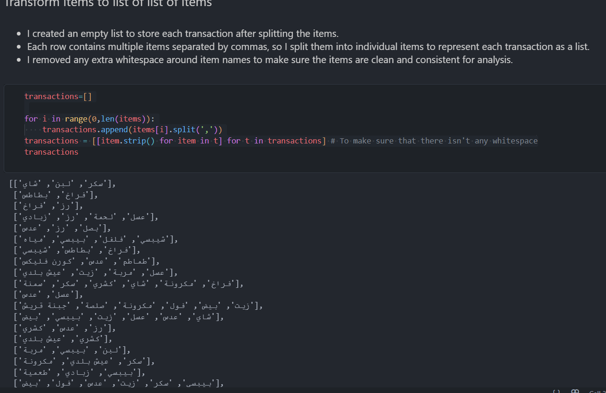
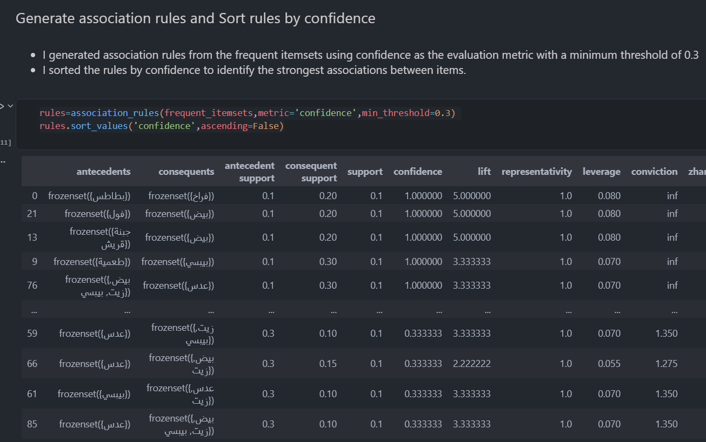
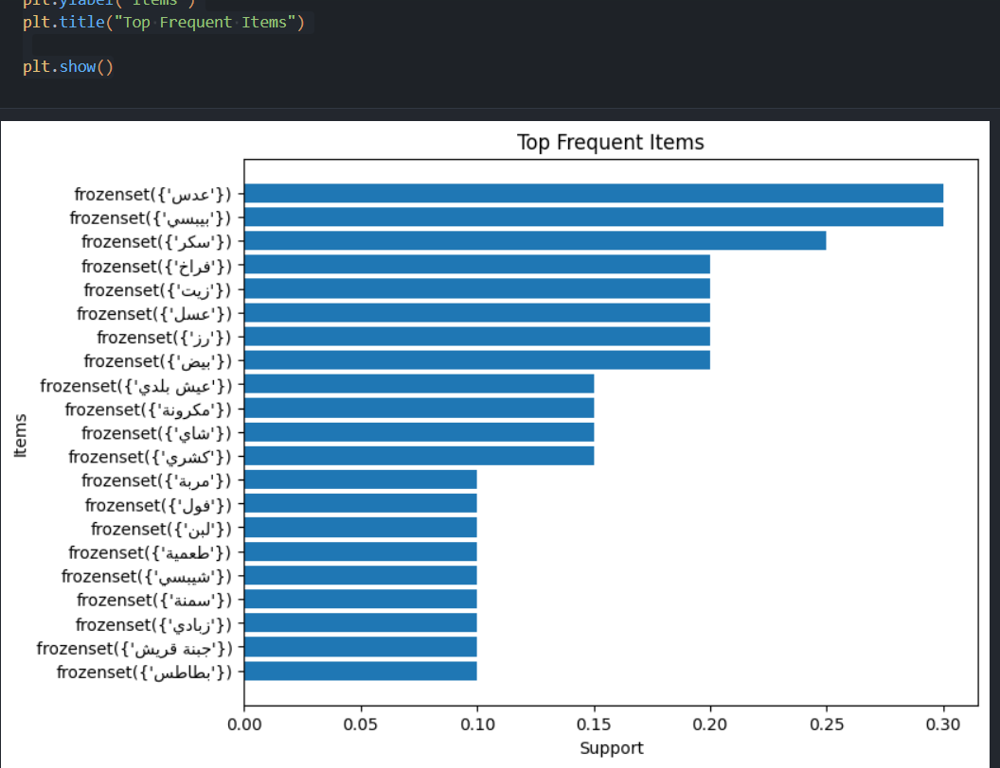
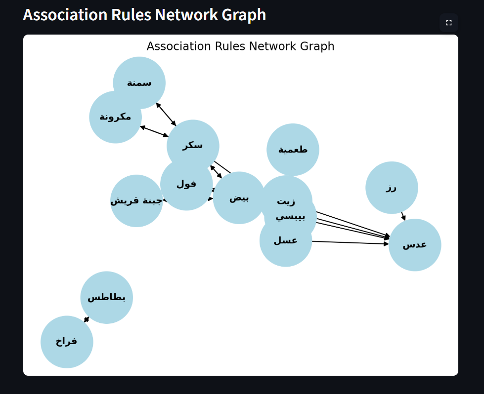
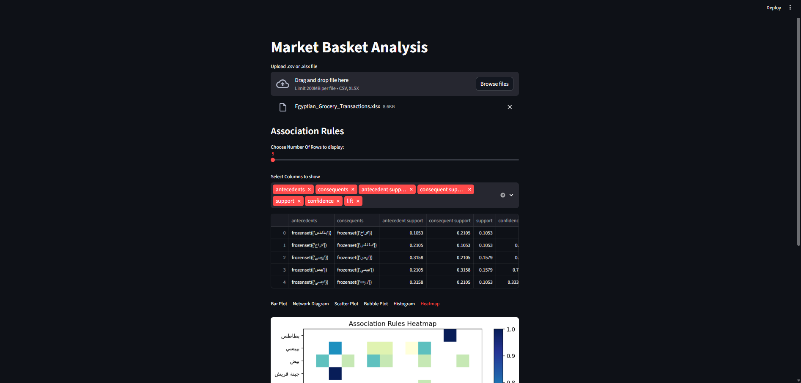

# 🛒 Market Basket Analysis
**Powered by Python, Streamlit — Built for the DataMining Course for ITI G**

## 📋 Overview
This project performs a **Market Basket Analysis** to identify patterns of items frequently purchased together. The workflow includes **data preparation, association rules discovery**, and **interactive visualizations** using both **Jupyter Notebook** and a **Streamlit Web App**.  

The analysis helps uncover actionable insights for **product placement, cross-selling, and promotional strategies**.  

The dataset used for this project is related to **Egyptian grocery transactions** (`Egyptian_Grocery_Transactions.xlsx`) containing common food products. 🍳🥖🥛  

💡 **Note:** The project is flexible and can handle grocery datasets with **items in Arabic or English**, making it adaptable to any type of food-related transactional data.

---

## 🛠️ Tools & Libraries Used

| Tool / Library  |                       Purpose                           |
|-----------------|---------------------------------------------------------|
| Python 3.x      | Main programming language                               |
| pandas          | Data handling and preprocessing                         |
| NumPy           | Numerical computations and array operations             |
| mlxtend         | Apriori algorithm and association rules                 |
| matplotlib      | Bar charts, scatter plots, histograms, and heatmaps     |
| networkx        | Network diagrams for association rules                  |
| Streamlit       | Interactive web application                             |
| arabic_reshaper | Reshape Arabic text for proper display                  |
| python-bidi     | Handle bidirectional Arabic text display                |
| ipywidgets      | File upload and interactive widgets in Jupyter Notebook |

---

## 🧩 Project Workflow

### 1️⃣ Jupyter Notebook
- **Data preprocessing**: Cleaned and transformed transactional data into a list of items ready for Apriori analysis. 
 
 
- **Frequent Itemsets & Association Rules**: Identified relationships and patterns between products.  

- **Preliminary Visualizations**: Created initial bar charts, network diagrams to explore data.

### 2️⃣ Streamlit Web App
- **Dynamic data upload**: Supports CSV and Excel files.  
- **Interactive Visualizations**:
  - 📊 Bar chart of top frequent items  
  - 🕸️ Network diagram showing hidden relationships  
  - 📈 Scatter plot between numerical columns  
  - 🔵 Bubble plot of confidence vs lift, sized by support  
  - 📉 Distribution histogram  
  - 🌡️ Heatmap of confidence between items  
- **Arabic Support**: Labels properly reshaped and displayed using `arabic_reshaper` and `python-bidi`.

---

## 💡 Key Insights

- **🥚 Most Frequent Items**  
  Items like **Eggs, Oil, and Pepsi** appear very frequently in transactions, showing that many customers regularly buy them.  
  **Advice:** Use these items in promotions to attract more customers.

- **🥔 Strong Association Between Certain Products**  
  Customers who buy **Potatoes** often also buy **Chicken**.  
  **Advice:** Placing these items near each other can increase combined sales.

- **🍽️ High Confidence Rules**  
  Customers who buy **Falafel** are very likely to also buy **Beans** or **Eggs**, showing strong relationships.  
  **Advice:** Offer these items together as a breakfast combo.

- **📈 Lift Indicates Strong Product Relationships**  
  Combinations like **Eggs & Lentils** or **Oil & Pepsi** appear together more often than expected.  
  **Advice:** Good candidates for cross-selling promotions.

- **🥘 Meal Preparation Patterns**  
  Combinations like **Eggs, Oil, and Lentils** suggest customers are buying ingredients to cook full meals.  
  **Advice:** Create meal bundles using these ingredients.

- **🧀 Dairy and Breakfast Items Connection**  
  Items like **Cottage Cheese** often appear with **Eggs** and other breakfast foods.  
  **Advice:** Group these items in a breakfast section for easier shopping.

---

## ✅ Conclusion
This Market Basket Analysis project demonstrates the **power of transactional data analysis** for understanding customer behavior.  
By combining **Apriori rules**, **strong association discovery**, and **interactive visualizations** (including Arabic support), the project provides actionable insights that can **enhance sales strategies, cross-selling opportunities, and store organization**.  

The Streamlit Web App makes the analysis **dynamic and interactive**, allowing any grocery dataset—**in Arabic or English**—to reveal patterns and trends quickly and visually.  

---

## 👤 Author
**Yomna Ahmed Hamdy**  
Data Analyst & Data Scientist